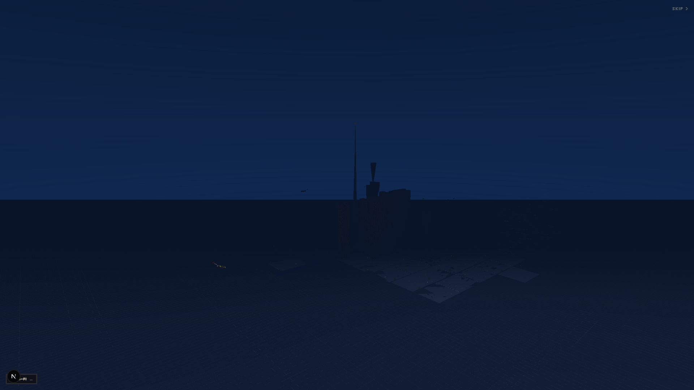
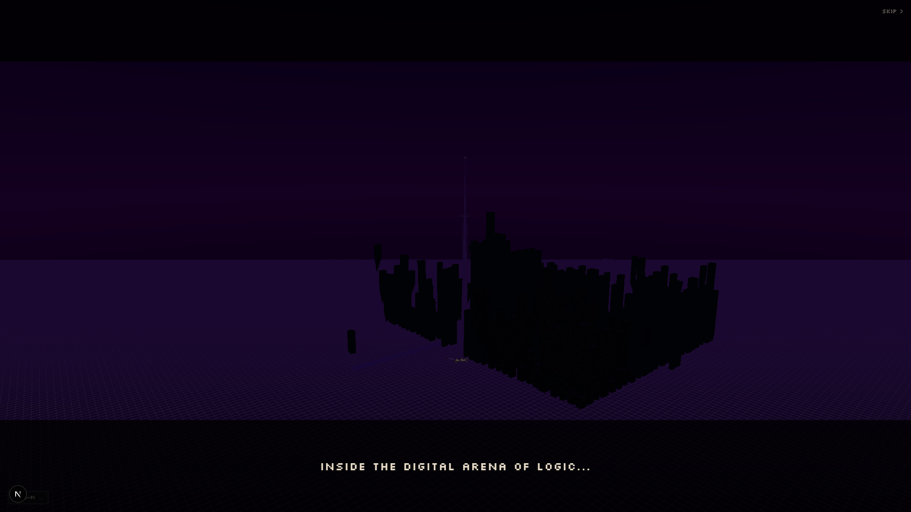
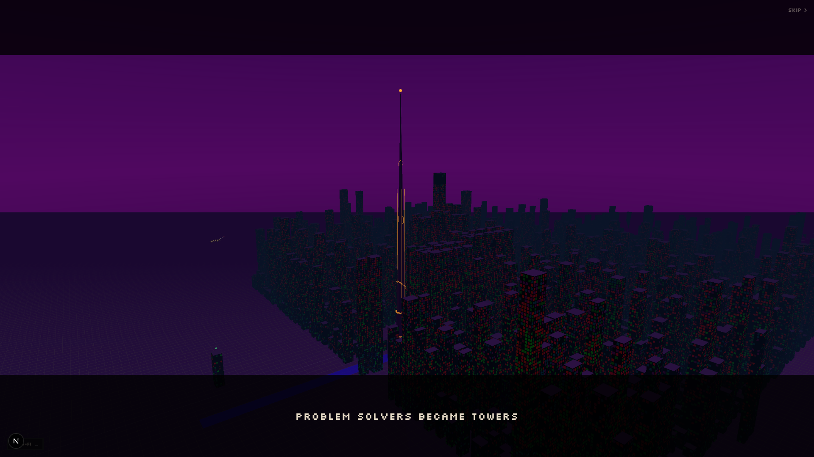
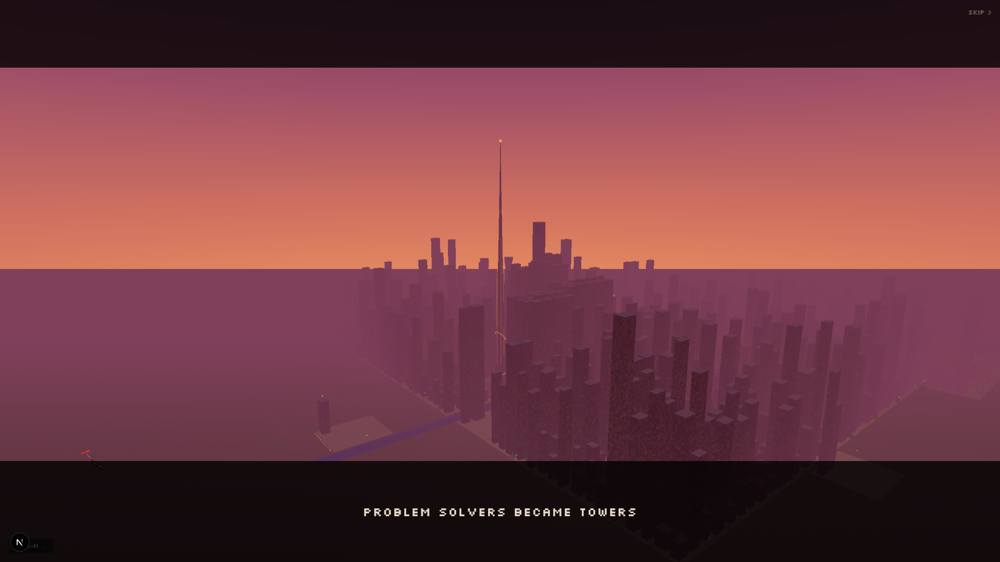

<h1 align="center">LeetCode City</h1>

<p align="center">
  <strong>Your LeetCode profile as a 3D pixel art building in an interactive city.</strong>
</p>

<p align="center">
  <a href="https://theleetcodecity.tech">theleetcodecity.tech</a>
</p>

<p align="center">
  
</p>

---

## What is LeetCode City?

LeetCode City transforms every LeetCode profile into a unique pixel art building. The more you solve, the taller your building grows. Explore an interactive 3D city, fly between buildings, and discover developers from around the world.

## Features

- **3D Pixel Art Buildings** — Each LeetCode user becomes a building with height based on submissions, width based on skill levels, and lit windows representing activity
- **Free Flight Mode** — Fly through the city with smooth camera controls, visit any building, and explore the skyline
- **Profile Pages** — Dedicated pages for each developer with stats, achievements, and top solved problems
- **Achievement System** — Unlock achievements based on submissions, points, and more
- **Building Customization** — Claim your building and customize it with items from the shop (crowns, auras, roof effects, face decorations)
- **Social Features** — Send kudos, gift items to other developers, refer friends, and see a live activity feed
- **Compare Mode** — Put two developers side by side and compare their buildings and stats
- **Share Cards** — Download shareable image cards of your profile in landscape or stories format

### Screenshots






## How Buildings Work

| Metric         | Affects           | Example                                |
|----------------|-------------------|----------------------------------------|
| Submissions    | Building height   | 1,000 solved → taller building         |
| Active Days    | Building width    | More active days → wider base          |
| Points         | Window brightness | More points → more lit windows         |
| Recent Activity| Window pattern    | Recent solve → distinct glow pattern   |

Buildings are rendered with instanced meshes and a LOD (Level of Detail) system for performance. Close buildings show full detail with animated windows; distant buildings use simplified geometry.

## Tech Stack

- **Framework:** [Next.js](https://nextjs.org) 16 (App Router, Turbopack)
- **3D Engine:** [Three.js](https://threejs.org) via [@react-three/fiber](https://github.com/pmndrs/react-three-fiber) + [drei](https://github.com/pmndrs/drei)
- **Database & Auth:** [Supabase](https://supabase.com) (PostgreSQL, GitHub OAuth, Row Level Security)
- **Payments:** [Stripe](https://stripe.com)
- **Styling:** [Tailwind CSS](https://tailwindcss.com) v4 with pixel font (Silkscreen)
- **Hosting:** [Vercel](https://vercel.com)

## Getting Started

```bash
# Clone the repo
git clone https://github.com/Ixotic27/The-Leetcode-City.git
cd leetcode-city

# Install dependencies
npm install

# Set up environment variables
cp .env.example .env.local
# Fill in Supabase and Stripe keys

# Run the dev server
npm run dev
```

Open [http://localhost:3001](http://localhost:3001) to see the city.

## License

[AGPL-3.0](LICENSE) — You can use and modify LeetCode City, but any public deployment must share the source code.

---

<p align="center">
  Original creator <a href="https://github.com/Ixotic27">@Ixotic27</a>
</p>
<p align="center">
  Inspired by <a href="https://github.com/srizzon/git-city">LeetCode City</a>
</p>
